# 🏗️ UCLAW 业务流架构图

> **增量批注（2026-03-26）**：当前分支已将 `DingTalk` 调整为软性收束：兼容入口保留，但不再进入现役执行链。本文内涉及钉钉客户端、`/webhook/dingtalk`、钉钉执行流的图示与表格，当前应按历史架构参考或兼容壳理解，不再代表现役部署面；现役 IM 主链以飞书为准。
>
> 本文档展示从数据库到前端的完整业务流向，帮助理解系统架构和数据流转。

---

## 📊 系统整体架构

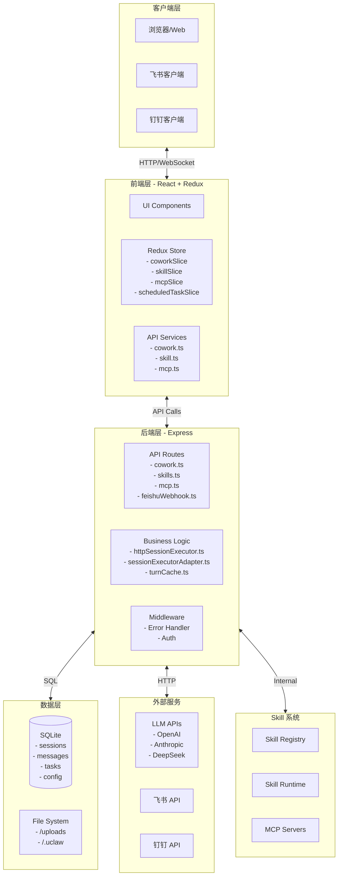

---

## 🔄 核心业务流

### 1. 协作会话创建流程

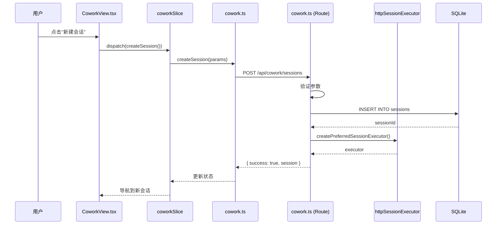

### 2. 消息发送与 AI 响应流程

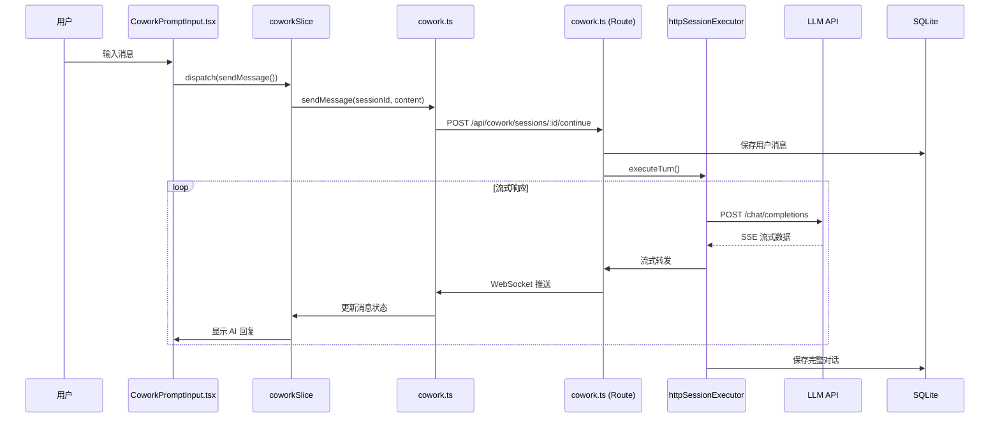

### 3. Skill 执行流程

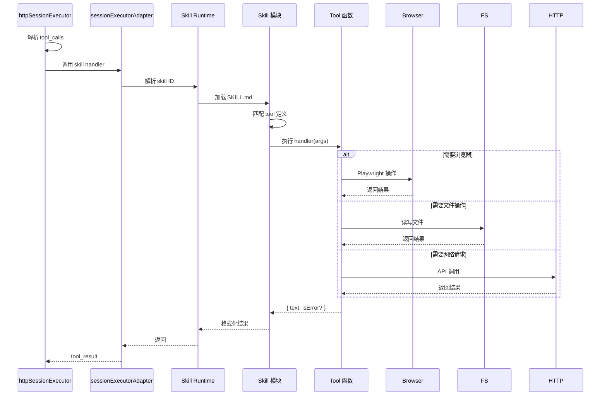

### 4. 飞书消息处理流程

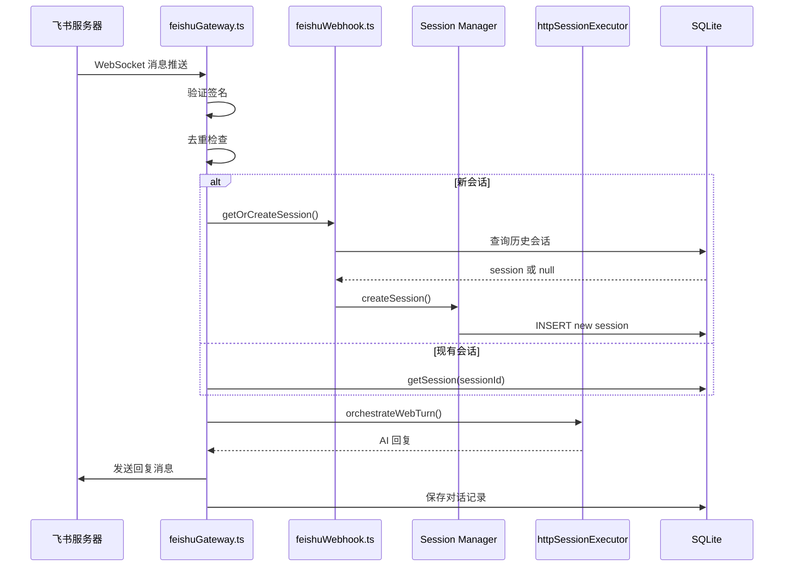

### 5. 定时任务执行流程

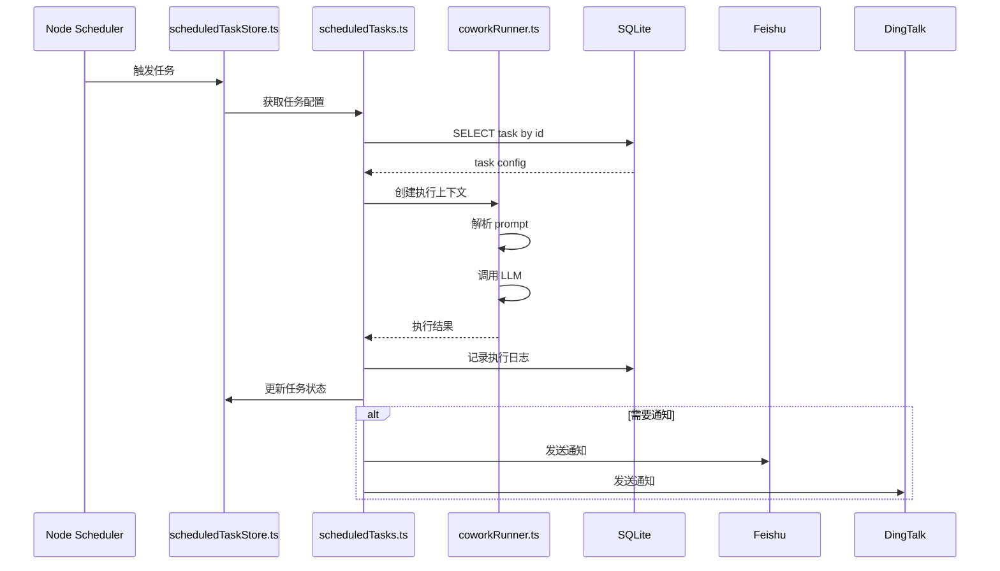

---

## 🗄️ 数据模型关系

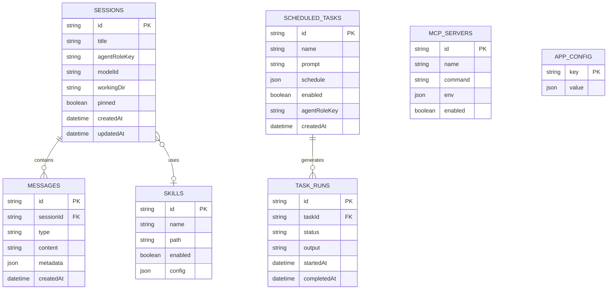

---

## 🔌 API 路由映射

### 核心 API 分组

```mermaid
graph LR
    subgraph API[API 路由 - server/routes/]
        direction TB
        
        subgraph Core[核心业务]
            COWORK[/api/cowork/*]
            SKILLS[/api/skills/*]
            MCP[/api/mcp/*]
        end
        
        subgraph System[系统功能]
            STORE[/api/store/*]
            FILES[/api/files/*]
            BACKUP[/api/backup/*]
        end
        
        subgraph Integration[外部集成]
            FEISHU[/webhook/feishu]
            DING[/webhook/dingtalk]
            SHELL[/api/shell]
        end
        
        subgraph Config[配置管理]
            APP[/api/app/*]
            API_CONFIG[/api/api-config/*]
            PERMS[/api/permissions/*]
        end
    end
    
    subgraph Frontend2[前端调用]
        Services2[services/*.ts]
        Store2[store/slices/*.ts]
    end
    
    Services2 --> COWORK
    Services2 --> SKILLS
    Services2 --> MCP
    Services2 --> STORE
    Store2 --> Services2
```

### 详细路由表

| 路由 | 文件 | 功能 | 前端对应 |
|------|------|------|----------|
| `GET /api/cowork/sessions` | cowork.ts | 获取会话列表 | cowork.ts#getSessions |
| `POST /api/cowork/sessions` | cowork.ts | 创建会话 | cowork.ts#createSession |
| `POST /api/cowork/sessions/:id/continue` | cowork.ts | 继续会话 | cowork.ts#sendMessage |
| `GET /api/skills` | skills.ts | 获取技能列表 | skill.ts#getSkills |
| `POST /api/skills/:id/enable` | skills.ts | 启用技能 | skill.ts#enableSkill |
| `GET /api/mcp/servers` | mcp.ts | 获取 MCP 服务器 | mcp.ts#getServers |
| `POST /api/mcp/servers` | mcp.ts | 创建 MCP 服务器 | mcp.ts#createServer |
| `GET /api/store/:key` | store.ts | 获取配置 | config.ts#get |
| `POST /api/store/:key` | store.ts | 保存配置 | config.ts#set |
| `POST /webhook/feishu` | feishuWebhook.ts | 飞书消息推送 | - |
| `POST /webhook/dingtalk` | dingtalkWebhook.ts | 钉钉消息推送 | - |

---

## 🎯 关键模块依赖

### 核心依赖图

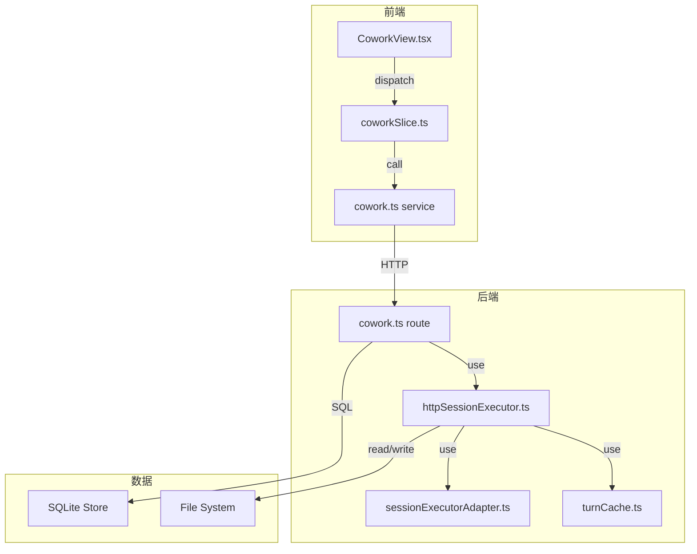

### 模块稳定性矩阵

| 模块 | 入度 | 出度 | 稳定性 | 说明 |
|------|------|------|--------|------|
| `src/shared/*` | 15+ | 3 | 🔴 低 | 被多处依赖，修改影响大 |
| `server/libs/httpSessionExecutor.ts` | 5 | 8 | 🟡 中 | 核心业务逻辑 |
| `server/libs/feishuGateway.ts` | 3 | 6 | 🟢 高 | 飞书集成，相对独立 |
| `src/renderer/services/cowork.ts` | 8 | 5 | 🟡 中 | 前端核心服务 |
| `server/routes/cowork.ts` | 2 | 10 | 🟢 高 | 路由层，依赖多但稳定 |

---

## 🔍 关键数据流

### 配置数据流

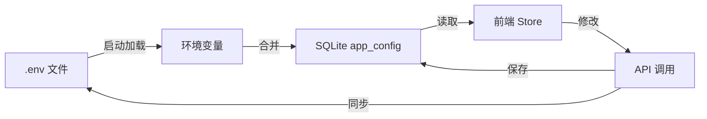

### 会话数据流

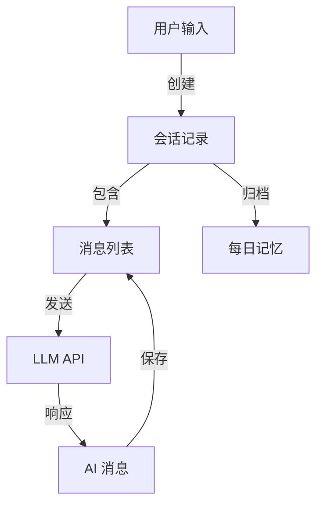

### Skill 数据流

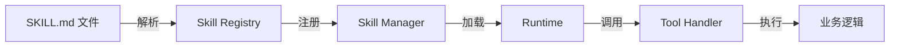

---

## 📝 维护要点

### 修改影响范围检查清单

在修改以下模块时，请检查影响范围：

| 模块 | 影响范围 | 检查项 |
|------|----------|--------|
| `src/shared/*` | 全项目 | 前后端类型定义同步 |
| `server/libs/httpSessionExecutor.ts` | 所有会话功能 | 测试所有会话场景 |
| `server/routes/cowork.ts` | 前端 cowork 模块 | 前端 API 调用同步 |
| `src/renderer/types/*` | 全前端 | 后端 API 契约同步 |
| `server/libs/feishuGateway.ts` | 飞书集成 | 飞书消息收发测试 |

### 代码审查关注点

1. **类型安全**：新增代码是否避免使用 `any`？
2. **错误处理**：是否有完善的错误处理和日志？
3. **API 契约**：前后端类型定义是否同步？
4. **性能影响**：数据库查询是否有索引？是否有 N+1 问题？
5. **安全性**：用户输入是否验证？是否有注入风险？

---

> **文档版本**：1.0  
> **最后更新**：2026-03-26  
> **维护者**：Agent 团队
