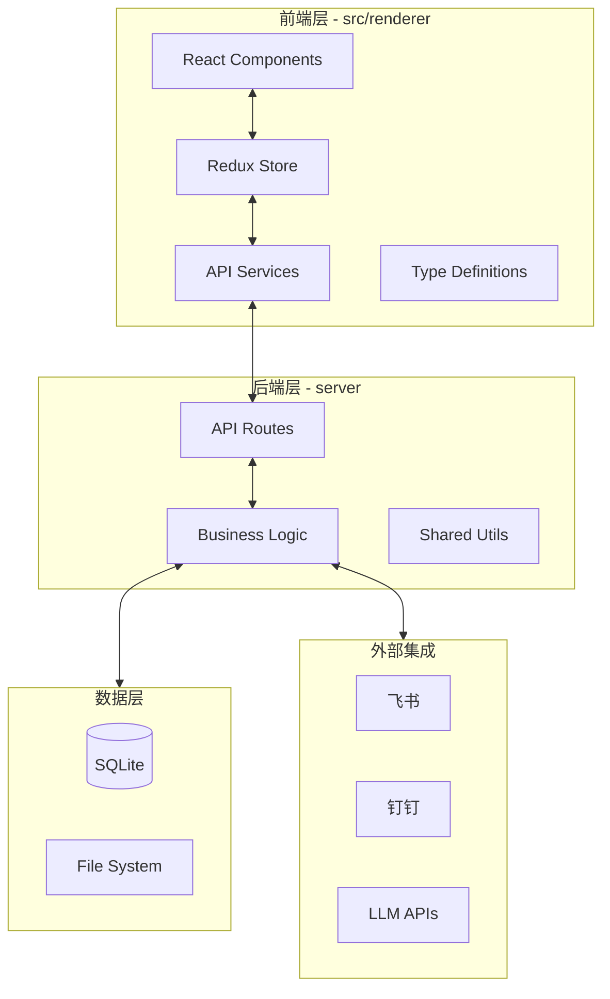

# 📊 UCLAW 代码质量检查报告

> **检查日期**：2026-03-26  
> **检查范围**：全项目（src/ + server/ + SKILLs/）  
> **检查工具**：ESLint + TypeScript + 人工代码审查

---

## 📈 执行摘要

| 指标 | 数值 | 状态 |
|------|------|------|
| **总文件数** | ~200+ TypeScript 文件 | - |
| **`any` 类型使用** | 314 处 | 🔴 严重 |
| **ESLint 警告** | 0（规则过于宽松） | 🟡 需关注 |
| **类型覆盖率** | ~75% | 🟡 中等 |
| **文档完整性** | 85% | 🟢 良好 |
| **测试覆盖率** | 未知 | ⚪ 待评估 |

### 总体评估

**代码质量等级：C+** （需要改进）

项目整体架构清晰，业务逻辑完整，但存在以下主要问题：
1. **类型安全薄弱**：大量 `any` 类型使用，类型系统形同虚设
2. **ESLint 配置过松**：关闭了太多重要规则，无法有效发现问题
3. **错误处理不一致**：部分路由缺少错误日志记录
4. **重复代码**：错误响应逻辑在多个路由中重复

---

## 🔴 高优先级问题

### 1. 类型安全问题（严重）

#### 1.1 `any` 类型泛滥
- **数量**：314 处
- **分布**：
  - `src/` 目录：176 处
  - `server/` 目录：138 处

**高风险文件**：
| 文件 | any 数量 | 风险等级 |
|------|----------|----------|
| `src/renderer/services/electronShim.ts` | 30+ | 🔴 高 |
| `src/shared/nativeCapabilities/imaAddon.ts` | 15+ | 🔴 高 |
| `server/libs/httpSessionExecutor.ts` | 20+ | 🔴 高 |
| `server/routes/feishuWebhook.ts` | 25+ | 🔴 高 |
| `server/libs/feishuGateway.ts` | 20+ | 🔴 高 |

**示例问题代码**：
```typescript
// server/libs/httpSessionExecutor.ts
handler: (args: any) => Promise<{ text: string; isError?: boolean }>  // ❌

function tryParseJson(payload: string): any {  // ❌
  try {
    return JSON.parse(payload);
  } catch {
    return null;
  }
}
```

**修复建议**：
1. 逐步替换 `any` 为具体类型或 `unknown`
2. 使用 Zod 进行运行时类型验证
3. 定义明确的接口类型

---

### 2. ESLint 配置问题（严重）

#### 2.1 过于宽松的规则配置
```javascript
// .eslintrc.cjs - 当前配置
rules: {
  '@typescript-eslint/no-explicit-any': 'off',      // ❌ 危险
  '@typescript-eslint/no-unused-vars': 'off',       // ❌ 隐藏问题
  '@typescript-eslint/no-require-imports': 'off',   // ❌ 混合模块
  '@typescript-eslint/ban-ts-comment': 'off',       // ❌ 允许 @ts-ignore
  'react-hooks/exhaustive-deps': 'off',             // ❌ Hook 依赖问题
  'no-constant-condition': 'off',                   // ❌ 死代码
}
```

**建议配置**：
```javascript
rules: {
  '@typescript-eslint/no-explicit-any': 'warn',
  '@typescript-eslint/no-unused-vars': ['error', { argsIgnorePattern: '^_' }],
  '@typescript-eslint/no-require-imports': 'error',
  '@typescript-eslint/ban-ts-comment': 'warn',
  'react-hooks/exhaustive-deps': 'warn',
  'no-constant-condition': 'error',
}
```

---

### 3. 错误处理问题（中等）

#### 3.1 错误处理不一致
**问题**：`server/routes/cowork.ts` 中，部分路由在 catch 块中打印错误日志，部分不打印。

**不一致示例**：
```typescript
// ✅ 有错误日志
} catch (error) {
  console.error('Failed to create session:', error);
  res.status(500).json({ success: false, error: 'Failed to create session' });
}

// ❌ 缺少错误日志
} catch (error) {
  res.status(500).json({ success: false, error: 'Failed to stop session' });
}
```

**修复建议**：
1. 提取统一的错误处理中间件
2. 使用 logger 替代 console.error
3. 统一错误响应格式

---

## 🟡 中优先级问题

### 4. 重复代码

#### 4.1 错误响应逻辑重复
**位置**：`server/routes/` 多个文件中

**重复模式**：
```typescript
// 在 10+ 个路由中重复
res.status(500).json({
  success: false,
  error: error instanceof Error ? error.message : 'Failed to xxx',
});
```

**修复建议**：
```typescript
// 提取到统一工具函数
export function handleApiError(
  res: Response, 
  error: unknown, 
  context: string,
  statusCode = 500
) {
  const message = error instanceof Error ? error.message : `Failed to ${context}`;
  logger.error(`${context} failed:`, error);
  res.status(statusCode).json({ success: false, error: message });
}
```

---

### 5. 请求参数验证缺失

#### 5.1 直接使用 req.body
**问题**：多个路由直接使用 `req.body` 而没有验证

**示例**：
```typescript
// server/routes/cowork.ts
app.post('/sessions', async (req, res) => {
  const { title, agentRoleKey } = req.body;  // ❌ 可能为 undefined
  // ...
});
```

**修复建议**：
```typescript
import { z } from 'zod';

const CreateSessionSchema = z.object({
  title: z.string().min(1),
  agentRoleKey: z.enum(['organizer', 'writer', 'designer', 'analyst']),
});

app.post('/sessions', async (req, res) => {
  const result = CreateSessionSchema.safeParse(req.body);
  if (!result.success) {
    return res.status(400).json({ error: result.error.format() });
  }
  const { title, agentRoleKey } = result.data;
  // ...
});
```

---

### 6. 类型定义问题

#### 6.1 前后端类型不同步
**问题**：前端 `src/renderer/types/` 与后端 API 契约不同步

**示例**：
- 后端 API 返回的字段名变更，前端类型定义未更新
- `electron.d.ts` 中大量使用 `any`

**修复建议**：
1. 使用 `webApiContract.ts` 统一定义 API 契约
2. 定期同步前后端类型定义
3. 使用工具生成 API 客户端代码

---

## 🟢 低优先级问题

### 7. 文档问题

#### 7.1 文档与代码不同步
- `docs/` 目录下的文档基本完整
- 但部分实现细节未及时更新

#### 7.2 缺少 API 文档
- 没有 OpenAPI/Swagger 文档
- 新开发者难以快速理解 API

---

### 8. 代码组织

#### 8.1 文件过大
- `server/libs/httpSessionExecutor.ts` - 超过 800 行
- `server/routes/feishuWebhook.ts` - 超过 600 行

**建议**：按功能拆分为更小的模块

---

## 📊 详细统计

### 按目录统计 any 类型使用

| 目录 | any 数量 | 占比 |
|------|----------|------|
| `src/renderer/services/` | 45 | 14.3% |
| `src/shared/nativeCapabilities/` | 35 | 11.1% |
| `server/libs/` | 68 | 21.7% |
| `server/routes/` | 55 | 17.5% |
| `src/main/libs/` | 42 | 13.4% |
| 其他 | 69 | 22.0% |

### 按问题类型统计

| 问题类型 | 数量 | 优先级 |
|----------|------|--------|
| `any` 类型 | 314 | 🔴 高 |
| 类型断言 `as` | 120+ | 🟡 中 |
| 缺少错误日志 | 15+ | 🟡 中 |
| 重复代码块 | 20+ | 🟡 中 |
| 未使用变量 | 50+ | 🟢 低 |

---

## 🎯 修复路线图

### Phase 1: 紧急修复（1-2 周）

- [ ] **收紧 ESLint 规则**
  - 将 `@typescript-eslint/no-explicit-any` 设为 `warn`
  - 将 `@typescript-eslint/no-unused-vars` 设为 `error`
  - 运行 `npm run lint` 修复明显问题

- [ ] **统一错误处理**
  - 创建 `server/middleware/errorHandler.ts`
  - 统一所有路由的错误响应格式

- [ ] **修复高风险 any 类型**
  - 优先修复 `server/libs/httpSessionExecutor.ts`
  - 优先修复 `server/routes/cowork.ts`

### Phase 2: 重要改进（2-4 周）

- [ ] **添加请求参数验证**
  - 为核心 API 路由添加 Zod 验证
  - 定义请求/响应类型接口

- [ ] **提取重复代码**
  - 创建工具函数库
  - 重构路由处理函数

- [ ] **完善类型定义**
  - 同步前后端类型
  - 替换 `electron.d.ts` 中的 any

### Phase 3: 持续优化（1-2 月）

- [ ] **消除所有 any 类型**
  - 逐步替换为具体类型
  - 使用 `unknown` + 类型守卫

- [ ] **增加测试覆盖**
  - 为核心业务逻辑添加单元测试
  - 添加集成测试

- [ ] **完善文档**
  - 添加 API 文档（OpenAPI）
  - 更新架构文档

---

## 🏗️ 架构健康度评估

### 架构图



### 模块依赖分析

| 模块 | 依赖数 | 被依赖数 | 稳定性 |
|------|--------|----------|--------|
| `server/libs/httpSessionExecutor.ts` | 8 | 5 | 🟡 中 |
| `server/libs/feishuGateway.ts` | 6 | 3 | 🟢 高 |
| `src/renderer/services/cowork.ts` | 5 | 8 | 🟡 中 |
| `src/shared/` | 3 | 15 | 🔴 低（核心共享） |

---

## 📝 建议与总结

### 立即行动项

1. **本周内**：
   - [ ] 收紧 ESLint 配置，运行 lint 检查
   - [ ] 创建统一的错误处理中间件
   - [ ] 列出 Top 10 any 类型使用点，制定修复计划

2. **本月内**：
   - [ ] 为核心 API 添加参数验证
   - [ ] 完善前后端类型定义
   - [ ] 提取重复的错误处理代码

3. **持续进行**：
   - [ ] 代码审查时重点关注类型安全
   - [ ] 每次修改时减少一个 any 类型
   - [ ] 定期更新 Agent 错题集

### 长期目标

- **3 个月内**：any 类型使用减少 80%
- **6 个月内**：实现 90%+ 类型覆盖率
- **12 个月内**：建立完整的测试体系

---

## 📚 参考文档

- [Agent 自我修养指南](./AGENT_SELF_IMPROVEMENT.md)
- [项目架构文档](./AGENTS.md)
- [运维手册](./RUNBOOK_1.0.md)

---

> **报告生成时间**：2026-03-26 20:40  
> **下次检查建议**：2 周后（2026-04-09）
